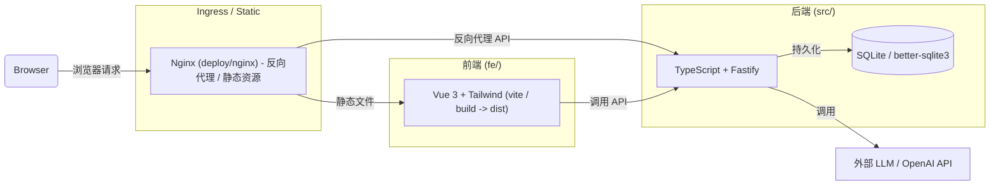

# 年度男娘程度总结器

 [](LICENSE)   

> "This project is part of the **Fancy Junk** series: Over-engineered solutions for non-existent problems."

输入你的名字，快速获得男娘程度打分与一句话小评价~

## 开发

前瞻：本项目前后端分离，前端代码位于 `fe/` 目录下，后端代码位于 `src/` 目录下。你需要有一个 OpenAI 兼容服务的 LLM 服务才能运行此项目。

### 项目架构



后端设计上：

1. 具有简单的队列功能（无限排队队列，并发具有限制，队列长度无限 *小心 OOM*），降低 LLM 并发压力
2. SQLite 缓存结果，避免同一名称不同结果
3. 具有输入限长，尽量避免提示词注入滥用
4. 使用了 OpenAI Json 结构化输出功能，尽量避免 LLM 输出格式错误

### 前端

```bash
fe
├── public
└── src
    └── assets
```

`fe` 目录下为前端代码，使用 Vue 3 + Tailwind CSS 编写。

### 后端

```bash
.
├── eslint.config.mjs
├── package-lock.json
├── package.json
├── README.md
├── src
│   └── index.ts
└── tsconfig.json
```

后端代码位于 `src` 目录下，使用 TypeScript + Fastify 编写。